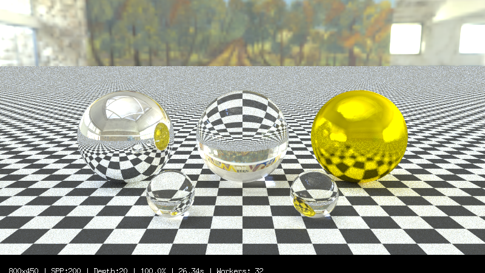

# Go Raytracing

Go raytracer following "Ray Tracing in One Weekend" series by Peter Shirley.

## Requirements

- Go 1.25.1+
- Ebiten v2 for progressive display

## Running

```bash
go run main.go
```

## Lastest Render



Renders to window with progressive scanline display. Saves final image as `image.png`.

## Features

### Rendering

- **Parallel bucket rendering** - Bucket rendering with multi-core CPU utilization (4-8x speedup)
- **Progressive multi-pass rendering** - Preview (1 SPP) → Refining (25% SPP) → Final (full SPP)
- **Spiral bucket ordering** - Center-out rendering for better visual feedback
- Anti-aliasing via multi-sampling (configurable samples/pixel)
- Gamma correction (gamma 2.0)
- Max ray depth control for indirect lighting

### Camera

- Positionable in 3D space (`LookFrom`, `LookAt`)
- Adjustable field of view (`Vfov`)
- Depth of field (defocus blur via `DefocusAngle`, `FocusDist`)
- Camera motion blur support
- HDRI environment maps with rotation, optional phantom background, and toggleable importance sampling (works with MIS/NEE)

**Presets:**

- `QuickPreview()` - 400x225, 10 samples, 10 depth
- `StandardQuality()` - 600x338, 100 samples, 50 depth, DOF enabled
- `HighQuality()` - 1200x675, 500 samples, 50 depth, DOF enabled

**Builder API:**

```go
camera := rt.NewCameraBuilder().
    SetResolution(800, 16.0/9.0).
    SetQuality(100, 50).
    SetPosition(
        rt.Point3{X: 13, Y: 2, Z: 3},
        rt.Point3{X: 0, Y: 0, Z: 0},
        rt.Vec3{X: 0, Y: 1, Z: 0},
    ).
    SetLens(20, 0.6, 10.0).
    AddLight(areaLight).
    Build()
```

### Materials

- **Lambertian** - Diffuse/matte surfaces
- **Metal** - Reflective surfaces w/ adjustable fuzz
- **Dielectric** - Glass/transparent materials w/ refraction, Fresnel effects (Schlick approximation), hollow sphere support
- **DiffuseLight** - Emissive surfaces for area lights

### Textures

- **SolidColor** - Uniform color
- **CheckerTexture** - 3D procedural checkerboard
- **ImageTexture** - Image-based textures (PNG/JPEG support)
- **NoiseTexture** - Perlin noise-based procedural texture

### Acceleration

**BVH (Bounding Volume Hierarchy):**

- Custom BVH implementation with recursive binary tree construction
- Longest-axis splitting heuristic for optimal tree balance
- Pre-built mesh BVH for OBJ models (hundreds of thousands of triangles)
- Ray culling via bounding box tests
- 10-100x speedup for large scenes

```go
bvh := rt.NewBVHNodeFromList(world)
```

### Geometry

- **Sphere** - Static and moving spheres
- **Plane** - Infinite planes
- **Quad** - Axis-aligned quadrilaterals
- **Triangle** - Möller-Trumbore ray-triangle intersection
- **Circle/Disk** - Flat circular surfaces
- **Box** - Compound primitive (6 quads)
- **Pyramid** - Compound primitive (4 triangles + base)
- **OBJ Mesh Loading** - Wavefront OBJ file support with automatic BVH construction
- **BVHNode** - Acceleration structure node
- All objects have axis-aligned bounding boxes

### Transforms

- **Translate** - Position offset
- **RotateX/Y/Z** - Axis-aligned rotation
- **Scale** - Uniform and non-uniform scaling
- **Transform builder** - Chainable API with SRT ordering (Scale-Rotate-Translate)

### Lighting

- **Multiple Importance Sampling (MIS)** - Optimal combination of light sampling (NEE) and BRDF sampling using balance heuristic
- **Next Event Estimation (NEE)** - Direct light sampling for reduced noise
- **PDF-based Sampling** - Importance sampling for lights, BRDF, and mixed strategies
- HDRI environment lighting with luminance-weighted sampling
- **Area lights** - Quad-based emissive surfaces
- **Light registration** - Camera tracks lights for importance sampling
- **Shadow rays** - Visibility testing with proper PDF weighting

### Scenes

Predefined scenes:

- `RandomScene()` - Configurable random sphere distribution
- `CheckeredSpheresScene()` - Two checkered spheres
- `SimpleScene()` - Basic test scene
- `PerlinSpheresScene()` - Spheres with Perlin noise textures
- `EarthScene()` - Textured Earth sphere
- `QuadsScene()` - Box-like room made of quads
- `CornellBoxScene()` - Classic Cornell Box with diffuse materials
- `CornellBoxGlossy()` - Cornell Box with glossy metal spheres showcasing MIS
- `CornellBoxLucy()` - Cornell Box with Lucy statue mesh (280K triangles)
- `GlossyMetalTest()` - Three spheres with varying roughness
- `PrimitivesScene()` - Scene showcasing various primitives
- `HDRITestScene()` - Glass/metal spheres lit by HDRI environment
- `CornellSmoke()` - Cornell box with volumetric fog/smoke boxes

Scene flag keys: `hdri-test`, `random`, `checkered`, `simple`, `perlin`, `earth`, `quads`, `cornell`, `cornell-glossy`, `cornell-lucy`, `cornell-smoke`, `glossy-metal`, `primitives`.

`SceneConfig` allows control over material probabilities, motion blur per material, grid bounds, etc.

## Usage

```go
// Basic setup with bucket renderer
world := rt.RandomScene()
bvh := rt.NewBVHNodeFromList(world)

camera := rt.NewCamera()
camera.ApplyPreset(rt.StandardQuality())
camera.LookFrom = rt.Point3{X: 13, Y: 2, Z: 3}
camera.LookAt = rt.Point3{X: 0, Y: 0, Z: 0}
camera.Initialize()

renderer := rt.NewBucketRenderer(camera, bvh)
ebiten.RunGame(renderer)
```

Default `go run main.go` uses `-scene hdri-test` (glass + metals under HDRI). Swap scenes via the `-scene` flag, or by calling `world, camera := rt.SomeScene()` in `main.go`.

```go
// Load OBJ mesh
mesh := rt.LoadOBJ("models/lucy.obj", rt.NewLambertian(rt.NewSolidColor(0.8, 0.8, 0.8)))

// Or with transform
mesh := rt.LoadOBJWithTransform(
    "models/lucy.obj",
    rt.NewLambertian(rt.NewSolidColor(0.8, 0.8, 0.8)),
    rt.RotateY(180) * rt.Scale(0.25, 0.25, 0.25),
)
```

```go
// Camera Builder API
camera := rt.NewCameraBuilder().
    SetResolution(800, 16.0/9.0).
    SetQuality(100, 50).
    SetPosition(
        rt.Point3{X: 13, Y: 2, Z: 3},
        rt.Point3{X: 0, Y: 0, Z: 0},
        rt.Vec3{X: 0, Y: 1, Z: 0},
    ).
    SetLens(20, 0.6, 10.0).
    AddLight(areaLight).
    Build()
```

```go
// Custom Random Scene
config := rt.DefaultSceneConfig()
config.LambertProb = 0.5
config.MetalProb = 0.3
config.DielectricProb = 0.2
config.SphereGridBounds.MinA = -5
config.SphereGridBounds.MaxA = 5
world := rt.RandomSceneWithConfig(config)
```

## Profiling

Built-in profiling support for performance analysis using Go's `pprof` tooling.

### Command-Line Flags

```bash
# Enable CPU and memory profiling
go run . -profile

# With execution tracing (concurrency analysis)
go run . -profile -trace

# Show memory statistics after render
go run . -mem-stats

# Custom profile output directory
go run . -profile -profile-dir="my_profiles"

# All flags
go run . -help
```

| Flag | Purpose | Default |
| --- | --- | --- |
| -profile | Enable profiling bundle | false |
| -cpu-profile | Capture CPU profile (requires -profile) | true |
| -mem-profile | Capture heap profile (requires -profile) | true |
| -block-profile | Capture goroutine blocking profile (requires -profile) | false |
| -trace | Enable execution trace (requires -profile) | false |
| -profile-dir | Profile output directory | profiles |
| -mem-stats | Print Go memory stats after render | false |
| -scene | Choose scene (see list above) | hdri-test |

### Quick CLI Examples

```bash
# Build and run
go run .

# Profile CPU + heap, print mem stats, store profiles in custom dir
go run . -profile -profile-dir="profiles/run1" -mem-stats

# Add block profiling and execution trace
go run . -profile -block-profile -trace -profile-dir="profiles/trace_run"

# Switch scenes (Cornell with smoke volume)
go run . -scene cornell-smoke
```

### Analyzing Profiles

```bash
# Interactive CPU profile analysis
go tool pprof profiles/cpu_*.pprof

# Top functions by cumulative time
go tool pprof -top -cum profiles/cpu_*.pprof

# Memory profile (allocations)
go tool pprof -top profiles/mem_*.pprof

# Web-based visualization (opens browser)
go tool pprof -http=:8080 profiles/cpu_*.pprof

# Execution trace (concurrency, goroutines)
go tool trace profiles/trace_*.out
```

### Running Benchmarks

```bash
# Run all benchmarks
go test -bench=. ./rt/

# Benchmark with memory allocation stats
go test -bench=. -benchmem ./rt/

# Specific benchmark
go test -bench=BenchmarkVec3 ./rt/
```

### Collected Metrics

When profiling is enabled, the following statistics are tracked:

- **Ray count** - Total rays cast (primary + bounces)
- **BVH intersections** - Bounding box tests performed
- **Samples computed** - Total pixel samples
- **Pixels rendered** - Completed pixels
- **Memory usage** - Heap allocations, GC stats
- **Rays/second** - Throughput metric

## Implementation Status

**Ray Tracing in One Weekend:**

- [x] PNG output
- [x] Vec3/ray math
- [x] Sphere rendering
- [x] Surface normals
- [x] Anti-aliasing
- [x] Diffuse materials
- [x] Metal materials
- [x] Dielectric materials
- [x] Positionable camera
- [x] Depth of field

**Ray Tracing: The Next Week:**

- [x] Motion blur (object + camera)
- [x] BVH acceleration
- [x] Texture system (solid, checker, image)
- [x] Perlin noise
- [x] Quadrilaterals
- [x] Lights (emissive materials + NEE)
- [x] Cornell Box scene
- [x] Instances (translation/rotation/scale)
- [x] Volumes (fog/smoke)

**Additional:**

- [x] Progressive rendering w/ Ebiten
- [x] Infinite Plane primitive
- [x] Scene configuration system
- [x] Builder pattern API for camera
- [x] Triangle primitive
- [x] Circle/Disk primitive
- [x] Compound primitives (Box, Pyramid)
- [x] Transform system with SRT ordering
- [x] Next Event Estimation (NEE) for direct lighting
- [x] Preset scenes with cameras

## Resources

- [Ray Tracing in One Weekend](https://raytracing.github.io/books/RayTracingInOneWeekend.html)
- [Ray Tracing: The Next Week](https://raytracing.github.io/books/RayTracingTheNextWeek.html)

## License

Educational purposes, following public domain tutorial series.
