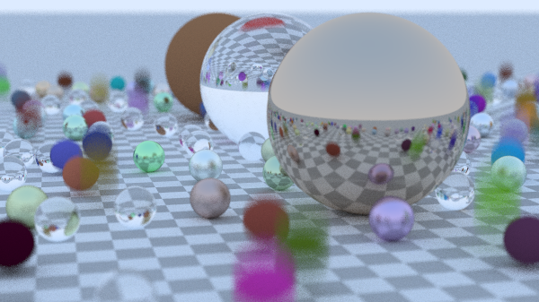

# Go Raytracing

Go raytracer following "Ray Tracing in One Weekend" series by Peter Shirley.

## Requirements

- Go 1.25.1+
- Ebiten v2 for progressive display

## Running

```bash
go run main.go
```

## Lastest Render



Renders to window with progressive scanline display. Saves final image as `image.png`.

## Features

### Rendering

- Progressive scanline rendering with live preview (Ebiten)
- Anti-aliasing via multi-sampling (configurable samples/pixel)
- Gamma correction (gamma 2.0)
- Max ray depth control for indirect lighting

### Camera

- Positionable in 3D space (`LookFrom`, `LookAt`)
- Adjustable field of view (`Vfov`)
- Depth of field (defocus blur via `DefocusAngle`, `FocusDist`)
- Camera motion blur support

**Presets:**

- `QuickPreview()` - 400x225, 10 samples, 10 depth
- `StandardQuality()` - 600x338, 100 samples, 50 depth, DOF enabled
- `HighQuality()` - 1200x675, 500 samples, 50 depth, DOF enabled

**Builder API:**

```go
camera := rt.NewCamera().
    SetResolution(800, 16.0/9.0).
    SetQuality(100, 50).
    SetPosition(
        rt.Point3{X: 13, Y: 2, Z: 3},
        rt.Point3{X: 0, Y: 0, Z: 0},
        rt.Vec3{X: 0, Y: 1, Z: 0},
    ).
    SetLens(20, 0.6, 10.0)
```

### Materials

- **Lambertian** - Diffuse/matte surfaces
- **Metal** - Reflective surfaces w/ adjustable fuzz
- **Dielectric** - Glass/transparent materials w/ refraction, Fresnel effects (Schlick approximation), hollow sphere support

### Textures

- **SolidColor** - Uniform color
- **CheckerTexture** - 3D procedural checkerboard
- **ImageTexture** - Image-based textures (PNG/JPEG support)

### Acceleration

**BVH (Bounding Volume Hierarchy):**

- Automatic construction from scene
- Recursive axis-aligned subdivision
- Ray culling via bounding box tests
- 10-100x speedup for large scenes

```go
bvh := rt.NewBVHNodeFromList(world)
```

### Geometry

- **Sphere** - Static and moving spheres
- **Plane** - Infinite planes
- All objects have axis-aligned bounding boxes

### Scenes

Predefined scenes:

- `RandomScene()` - Configurable random sphere distribution
- `CheckeredSpheresScene()` - Two checkered spheres
- `SimpleScene()` - Basic test scene

`SceneConfig` allows control over material probabilities, motion blur per material, grid bounds, etc.

## Usage

```go
// Basic setup
world := rt.RandomScene()
bvh := rt.NewBVHNodeFromList(world)

camera := rt.NewCamera()
camera.ApplyPreset(rt.StandardQuality())
camera.LookFrom = rt.Point3{X: 13, Y: 2, Z: 3}
camera.LookAt = rt.Point3{X: 0, Y: 0, Z: 0}
camera.Initialize()

renderer := rt.NewProgressiveRenderer(camera, bvh)
ebiten.RunGame(renderer)
```

**Custom scene config:**

```go
config := rt.DefaultSceneConfig()
config.LambertProb = 0.5
config.MetalProb = 0.3
config.DielectricProb = 0.2
config.SphereGridBounds.MinA = -5
config.SphereGridBounds.MaxA = 5
world := rt.RandomSceneWithConfig(config)
```

## Implementation Status

**Ray Tracing in One Weekend:**

- [x] PNG output
- [x] Vec3/ray math
- [x] Sphere rendering
- [x] Surface normals
- [x] Anti-aliasing
- [x] Diffuse materials
- [x] Metal materials
- [x] Dielectric materials
- [x] Positionable camera
- [x] Depth of field

**Ray Tracing: The Next Week:**

- [x] Motion blur (object + camera)
- [x] BVH acceleration
- [x] Texture system (solid, checker, image)
- [x] Perlin noise
- [ ] Quadrilaterals
- [ ] Lights
- [ ] Instances (translation/rotation)
- [ ] Volumes (fog/smoke)

**Additional:**

- [x] Progressive rendering w/ Ebiten
- [x] Infinite Plane primitive
- [x] Scene configuration system
- [x] Builder pattern API

## Resources

- [Ray Tracing in One Weekend](https://raytracing.github.io/books/RayTracingInOneWeekend.html)
- [Ray Tracing: The Next Week](https://raytracing.github.io/books/RayTracingTheNextWeek.html)

## License

Educational purposes, following public domain tutorial series.
